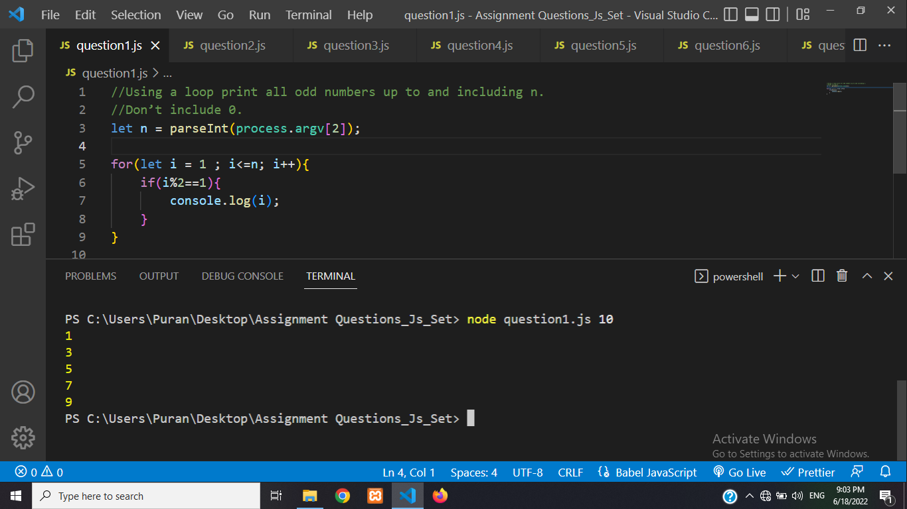
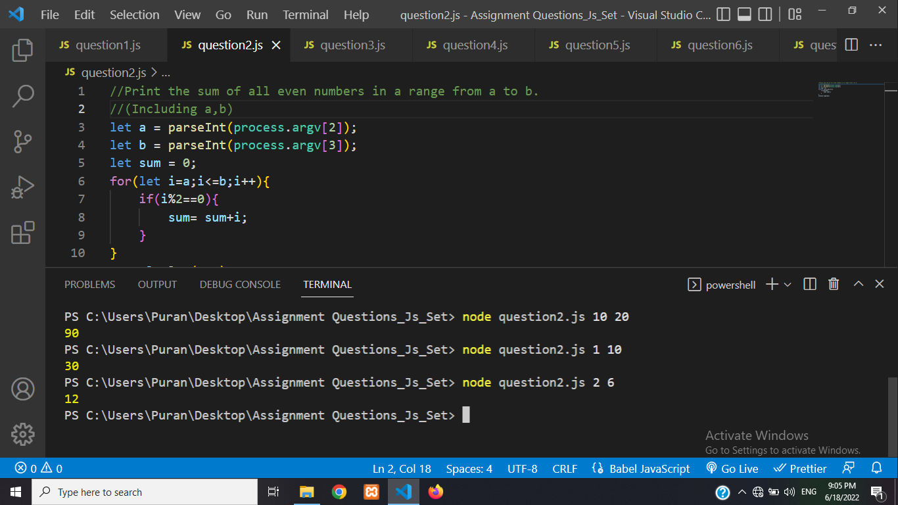
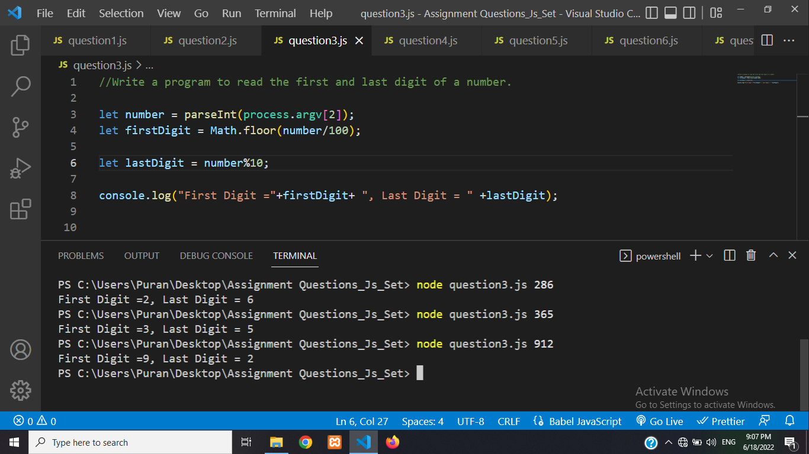
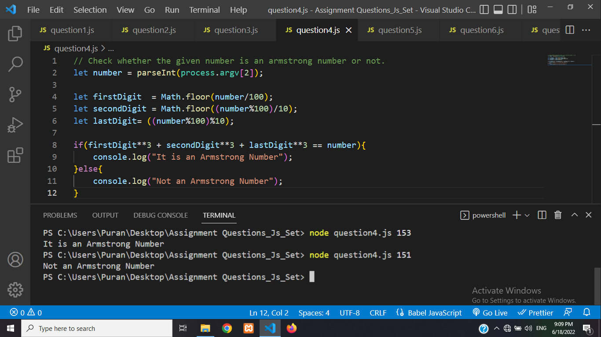
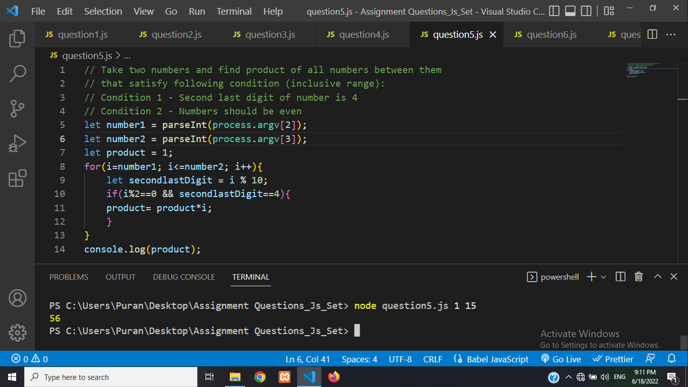
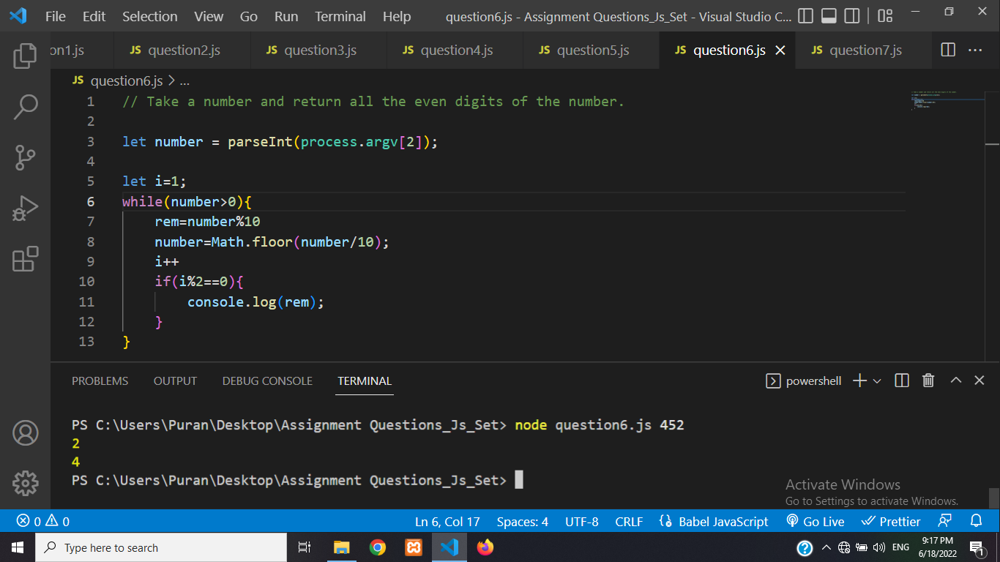
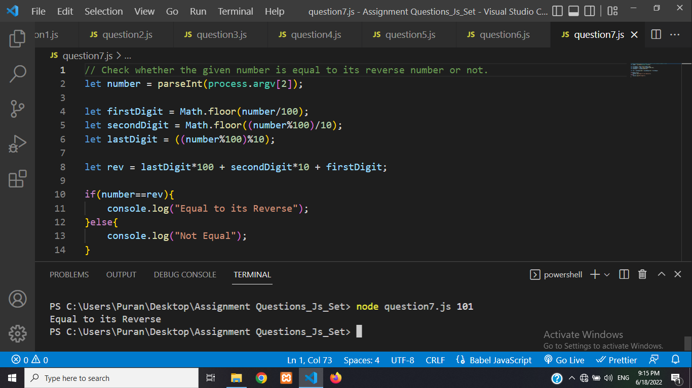

<h3>Q.No1</h3>

Using a loop print all odd numbers up to and including n.Don’t include 0.

Result

<h3>Q.No-2</h3>

Print the sum of all even numbers in a range from a to b.(Including a,b)

Result

<h3>Q.No-3</h3>

Write a program to read the first and last digit of a number.

Result

<h3>Q.No-4</h3>

Check whether the given number is an armstrong number or not.

Result

<h3>Q.No-5</h3>

Take two numbers and find product of all numbers between them
that satisfy following condition (inclusive range): 
Condition 1 - Second last digit of number is 4
Condition 2 - Numbers should be even

Result

<h3>Q.No-6</h3>

Take a number and return all the even digits of the number.

Result

<h3>Q.No-7</h3>

Check whether the given number is equal to its reverse number or not.

 Result

